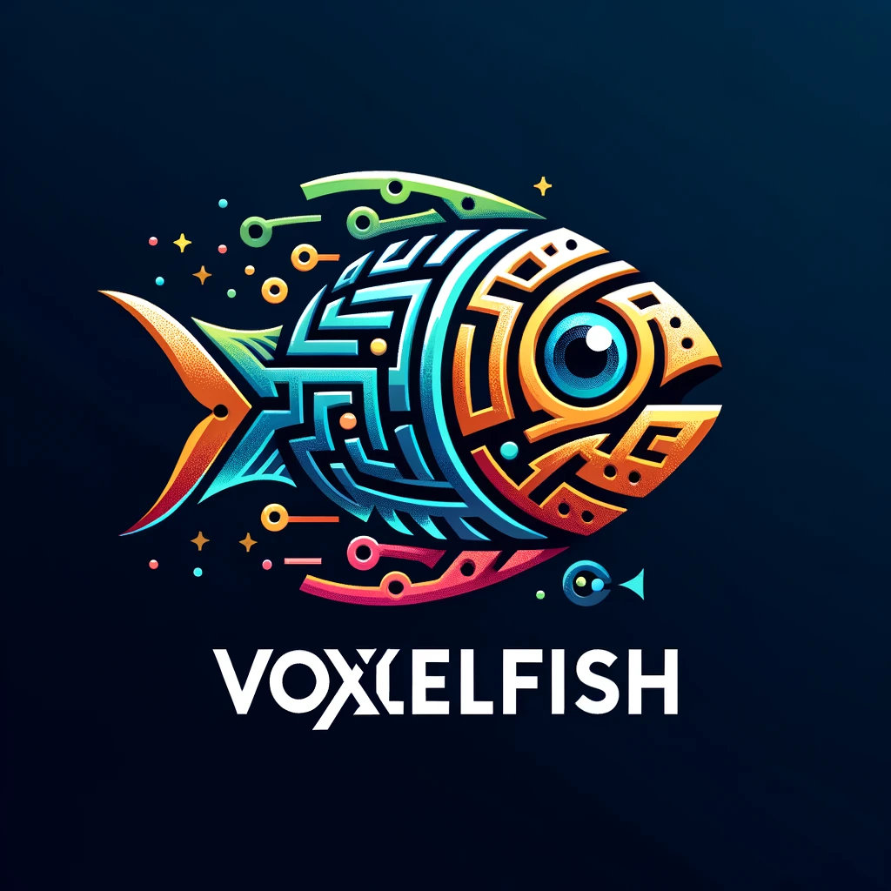

# VoxlFish

Welcome to VoxlFish, an open-source library revolutionizing language translation in software applications. VoxlFish is a robust C++ implementation of the Meta Seams Communication library and the ambitious NLLB (No Language Left Behind) project. Our goal is to bridge communication barriers by enabling seamless translation between 200 different languages. We are targeting embedded devices



## Features

- **Multilingual Support**: Translate between a vast range of 200 languages.
- **Audio and Text Translation**: Whether it's spoken words or written texts, VoxlFish has got you covered.
- **Cross-Platform Compatibility**: VoxlFish supports Kotlin bindings for Android and Swift bindings for iOS, making it a versatile choice for mobile application developers.
- **Real-Time Translation**: Experience near-instantaneous translation for fluid, natural communication.
- **High Accuracy**: Powered by advanced algorithms to ensure precise translations.

## Getting Started

To start using VoxlFish in your project, follow these simple steps:

### Prerequisites

Ensure you have a C++ compiler and environment set up. VoxlFish is compatible with most modern C++ environments.

### Installation

1. Clone the VoxlFish repository:
   ```bash
   git clone https://github.com/yourusername/VoxlFish.git
   ```


## Contributing

We encourage contributions! If you have ideas on how to improve VoxlFish or add new features, feel free to fork the repository, make your changes, and submit a pull request.

## License

VoxlFish is released under the [MIT License](LICENSE).

## Acknowledgments

A huge thank you to everyone involved in the Meta Seams Communication library and the NLLB project for their groundbreaking work in language translation technology.

---

Happy translating!

